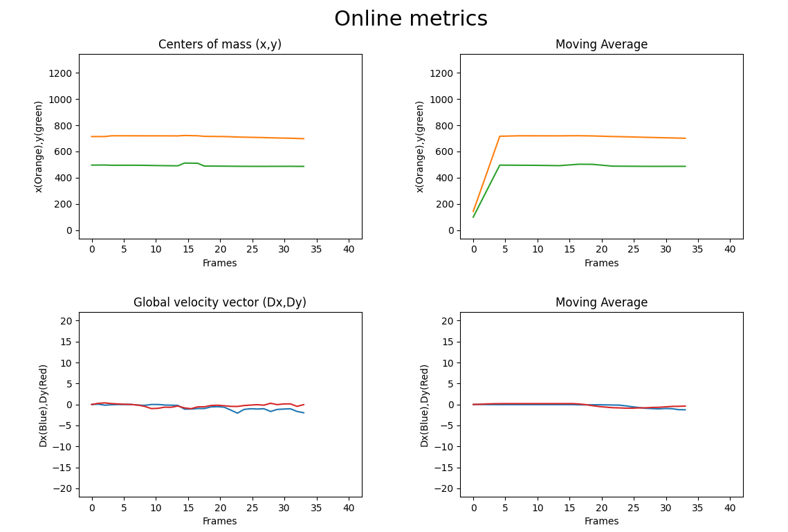
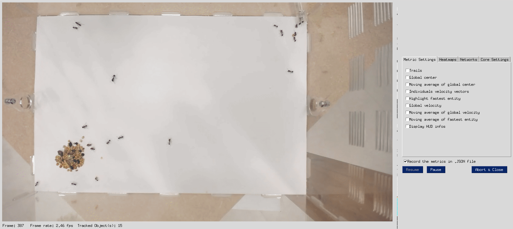
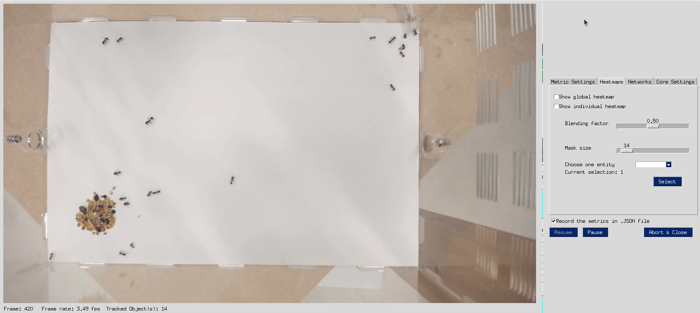
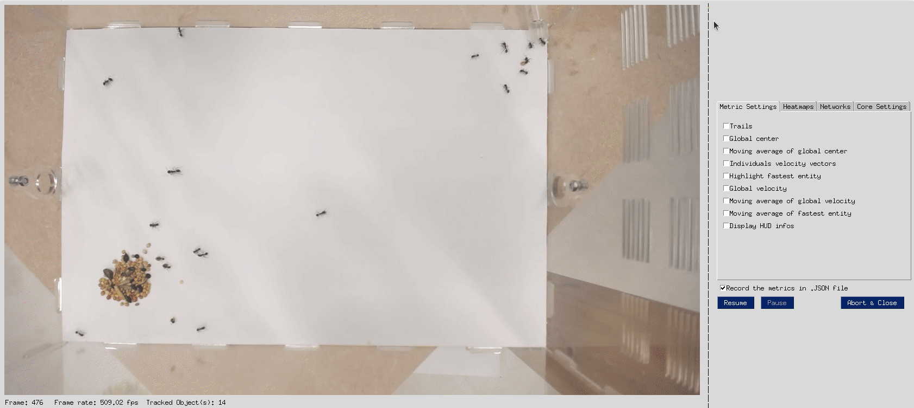

# Primitive swarm visualization tool on top of [ByteTrack](https://github.com/ifzhang/ByteTrack)
## Installation steps
One should first clone this repository and install the dependencies.  
```shell
git clone https://github.com/ldelzott/ByteTrack.git
pip3 install folium==0.2.1
pip3 install -r requirements.txt
pip install tinydb
pip install pysimplegui
pip uninstall -y torch torchvision torchaudio
pip install torch==1.7.1+cu110 torchvision==0.8.2+cu110 torchaudio==0.7.2 -f https://download.pytorch.org/whl/torch_stable.html
python3 setup.py develop
pip3 install cython; pip3 install 'git+https://github.com/cocodataset/cocoapi.git#subdirectory=PythonAPI'
pip3 install cython_bbox

```
One should download a pre-trained YOLOX model. This model must be placed in ByteTrack/pretrained.
```shell
wget https://github.com/Megvii-BaseDetection/YOLOX/releases/download/0.1.1rc0/yolox_x.pth
```
The train.py utility is used to train the model. The training is done on the dataset provided in ByteTrack/datasets/epucks_dataset_300
```shell
python3 /content/ByteTrack/tools/train.py -f /content/ByteTrack/exps/example/mot/yolox_x_mix_det.py -d 1 -b 2 --fp16 -o -c /content/ByteTrack/pretrained/yolox_x.pth
```
The visualization tool can be launched on the provided input video sequence aggregation-8-30fps-cropped.mp4
```shell
python3 /content/ByteTrack/tools/demo_track.py video --path /content/ByteTrack/videos/aggregation-8-30fps-cropped.mp4 -f /content/ByteTrack/exps/example/mot/yolox_x_mix_det.py -c /content/ByteTrack/YOLOX_outputs/yolox_x_mix_det/latest_ckpt.pth.tar --fp16 --fuse --save_result
```
## Functionalities 
# Graphs
The graphs show the value of metrics computed in real-time on the tracked objects. The current graphs range from 1 to 40 frames.  



# Configuration of the metrics
## Trails visualization
Shows the trails of the tracked objects. The maximum number of displayed points is 8000. The value can be adjusted during run time. 


## Velocity vectors
Shows an approximation of a velocity vector on each tracked object. 


## Fastest entity
Highlight the fastest moving entity, based on the computed velocity vectors.


## Combined visualizations
Any of the previous visualizations can be superposed during run time. 


## Global position heatmap
The radius of the masks used to generate the heat of each tracked object is overemphasized. The second example shows the heatmap obtained for a smaller mask radius. 





## Individual position heatmap
The position heatmap of each tracked entity can be displayed. The mask radius can be adjusted. 



## Networks map
Assuming objects can communicate with their neighbors under a given distance, the network map highlights the groups of objects in the same "communication cluster".      


# Recording
The process generate an output video. This output video shows the manipulations done in unpaused state in the visualization tool.
[video](https://github.com/ldelzott/ByteTrack/blob/main/assets/output_4_cropped_and_resized.mp4)


